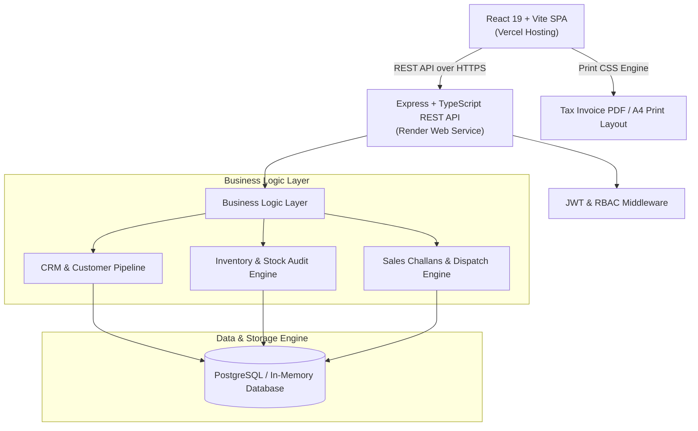

# 🚀 OptiERP — Enterprise ERP & CRM Operations Portal

---

<p align="center">
  
  
  
  
  
  
  
  <br />
  
</p>

<h3 align="center">A Production-Quality, Multi-Role Operations System for Wholesale & Distribution Enterprises</h3>

<p align="center">
  <a href="https://opti-erp.vercel.app/"><b>Live Frontend Application</b></a> • 
  <a href="https://optierp.onrender.com"><b>Live Backend API Service</b></a> • 
  <a href="https://github.com/Bhavyakela07/OptiERP"><b>GitHub Repository</b></a>
</p>

---

## 🏛️ System Architecture



---

## ✨ Key Features & Business Capabilities

### 🔐 1. Authentication & Role-Based Access Control (RBAC)
- **Multi-Role Security Engine**:
  - 👑 **Admin**: Complete system governance. User creation, customer account suspensions/unsuspensions, customer deletions, product deletions, and challan overrides.
  - 💼 **Sales**: Customer profile management, CRM follow-up tracking, draft sales challan creation, and dispatch confirmation.
  - 📦 **Warehouse**: Inventory product catalog management, stock IN/OUT manual adjustments, low-stock threshold auditing, and product deletions.
  - 📊 **Accounts**: Read-only financial dispatch review, tax invoice generation, and ledger auditing.
- **Inline Team Onboarding**: Admins can generate new team accounts directly inside the user profile view.
- **Security Best Practices**: Passwords hashed with `bcryptjs` (salt factor 10), JWT tokens with 24-hour expiration, and strict validation via `Zod`.

### 👥 2. Customer Relationship Management (CRM)
- **Mandatory Validation Engine**: Enforces compulsory Email Address, GSTIN number (`24AAACP...`), Business Name, and Mobile Number (strict 10-digit limit).
- **15-Day Account Suspension Controls**: Allows Admins to temporarily freeze accounts with auto-unsuspend calculation schedules and suspension reason tracking.
- **CRM Follow-Up Pipeline**: Log customer interaction notes, set future follow-up reminder dates, and track lifecycle status (`Lead` → `Active` → `Suspended`).
- **Account Protection & Clean Deletions**: Permanent customer record deletion reserved strictly for Admins with clean cascades.

### 📦 3. Products & Stock Control Engine
- **Inventory Tracking**: Monitor stock levels, SKU codes, categories, unit prices, and warehouse bin locations.
- **Real-Time Low Stock Alerts**: Highlights items falling below minimum stock threshold buffers.
- **Stock Movement Audit Logs**: Full transactional history of manual stock adjustments (`IN` vs `OUT`) with timestamps and user references.
- **Cascading Product Cleanups**: Deleting a product automatically cleans up corresponding stock movement histories without leaving orphaned rows.

### 📜 4. Sales Challans & Price Snapshot Engine
- **Unit Price Snapshotting**: Unit prices are frozen at the exact time of challan creation, ensuring past orders remain financially immutable even if product list prices are updated later.
- **Pre-Dispatch Stock Verification Audit**: Interactive modal validates available inventory against requested quantities before confirming dispatches.
- **Atomic Stock Deduction**: Confirming a sales challan atomically decrements inventory stock in a database transaction, preventing negative stock levels.

### 📄 5. Printable A4 Tax Invoice & PDF Export
- **Print-Optimized CSS (`@media print`)**: Formatted for standard A4 paper size, hiding UI navigation bars, buttons, and ambient backgrounds.
- **Complete Indian GST Compliance Breakdown**:
  - Company branding logo (`icon.png`) with crisp header typography.
  - Customer GSTIN, Billed To address, and Shipping details.
  - Itemized table showing HSN/SKU, Quantity, Unit Price, and Line Total.
  - Auto-calculated **CGST (9%)** + **SGST (9%)** or **IGST (18%)**.
  - **Grand Total converted to Rupee Words** (e.g. *"Rupees Twelve Thousand Five Hundred Only"*).
  - HDFC Bank payment details, Terms & Conditions, and Authorized Signatory signature block.
- **Interactive On-Screen Preview**: Standalone `EyeIcon` preview modal to inspect tax invoices before printing.

---

## 🛡️ Role & Permissions Matrix

| Feature / Action | Admin | Sales | Warehouse | Accounts |
| :--- | :---: | :---: | :---: | :---: |
| **Login & View Dashboard** | ✅ | ✅ | ✅ | ✅ |
| **View Customer List & Details** | ✅ | ✅ | ✅ | ✅ |
| **Create / Edit Customer** | ✅ | ✅ | ❌ | ❌ |
| **Suspend / Unsuspend Customer** | ✅ | ❌ | ❌ | ❌ |
| **Delete Customer** | ✅ | ❌ | ❌ | ❌ |
| **Add CRM Follow-Up Notes** | ✅ | ✅ | ❌ | ❌ |
| **View Product Inventory** | ✅ | ✅ | ✅ | ✅ |
| **Create / Edit Product** | ✅ | ❌ | ✅ | ❌ |
| **Record Stock Movement (IN/OUT)** | ✅ | ❌ | ✅ | ❌ |
| **Delete Product** | ✅ | ❌ | ✅ | ❌ |
| **Create Sales Challan** | ✅ | ✅ | ❌ | ❌ |
| **Confirm Challan & Deduct Stock** | ✅ | ✅ | ❌ | ❌ |
| **Preview & Export Tax Invoice PDF** | ✅ | ✅ | ✅ | ✅ |
| **Create New System Users** | ✅ | ❌ | ❌ | ❌ |

---

## 🛠️ Technology Stack

### Frontend Architecture
- **Framework**: React 19 + Vite 8
- **Language**: TypeScript 5
- **Routing**: React Router v7 (`BrowserRouter`)
- **HTTP Client**: Axios with request interceptors for JWT injection
- **Styling**: Vanilla CSS Design System with CSS Variables, Dark/Light Mode toggle, Glassmorphism, and `@media print` rules

### Backend Architecture
- **Runtime**: Node.js v20+
- **Framework**: Express.js
- **Language**: TypeScript 5
- **Validation**: Zod Schemas
- **Authentication**: JWT (`jsonwebtoken`) & `bcryptjs`
- **Database Engine**: PostgreSQL Driver (`pg`) with automatic In-Memory fallback (`pg-mem`) for zero-configuration deployments

---

## 🔑 Default Credentials

The system automatically initializes default user accounts upon server startup:

| Role | Email Address | Default Password |
| :--- | :--- | :--- |
| **Admin** | `admin@company.com` | `password123` |
| **Sales** | `sales@company.com` | `sales123` |
| **Warehouse** | `warehouse@company.com` | `warehouse123` |
| **Accounts** | `accounts@company.com` | `accounts123` |

---

## 📡 Complete REST API Reference

### 1. Auth Module (`/api/auth`)

#### `POST /api/auth/login`
Authenticates user and returns JWT token.
- **Request Body**:
  ```json
  {
    "email": "admin@company.com",
    "password": "password123"
  }
  ```
- **Response (200 OK)**:
  ```json
  {
    "token": "eyJhbGciOiJIUzI1Ni...",
    "user": {
      "id": "uuid-v4",
      "name": "Admin User",
      "email": "admin@company.com",
      "role": "Admin"
    }
  }
  ```

#### `GET /api/auth/me`
Fetches current logged-in user profile.
- **Headers**: `Authorization: Bearer <token>`

#### `POST /api/auth/users` *(Admin Only)*
Creates a new user account inside the system.

---

### 2. Customers Module (`/api/customers`)

#### `GET /api/customers`
Paginated search & list of customers.
- **Query Params**: `page=1&limit=10&search=Rajesh&status=Active`

#### `POST /api/customers`
Creates a new customer (enforces GST, Email, Phone <= 10 digits).

#### `POST /api/customers/:id/suspend` *(Admin Only)*
Suspends a customer for 15 days.

#### `DELETE /api/customers/:id` *(Admin Only)*
Deletes a customer profile permanently.

---

### 3. Products Module (`/api/products`)

#### `GET /api/products`
Lists catalog products with optional low stock filtering.

#### `POST /api/products` *(Admin / Warehouse)*
Creates a new product item.

#### `POST /api/products/:id/stock-movements` *(Admin / Warehouse)*
Records stock inventory IN or OUT.

---

### 4. Sales Challans Module (`/api/challans`)

#### `POST /api/challans` *(Admin / Sales)*
Drafts a new sales challan with unit price snapshotting.

#### `POST /api/challans/:id/confirm` *(Admin / Sales)*
Confirms challan dispatch & atomically decrements inventory stock.

---

## ⚡ Local Installation & Development Guide

### Prerequisites
- **Node.js**: `v18.0.0` or higher
- **npm**: `v9.0.0` or higher
- **Git**: Installed on system

### 1. Clone Repository
```bash
git clone https://github.com/Bhavyakela07/OptiERP.git
cd OptiERP
```

### 2. Setup & Run Backend
```bash
cd backend
npm install
npm run dev
```
*Backend will start on `http://localhost:4000` with auto-seeded demo database.*

### 3. Setup & Run Frontend
```bash
cd ../frontend
npm install
npm run dev
```
*Frontend will launch on `http://localhost:5173`.*

### 4. Run Automated Integration Tests
```bash
cd ../backend
npm test
```
*Executes all 21 automated backend tests validating RBAC, auth, customer suspensions, stock movements, and challan dispatches.*

---

## 🌐 Deployment Configuration

### Frontend Deployment (Vercel)
1. Import repository `Bhavyakela07/OptiERP` into Vercel.
2. Set **Root Directory** to `frontend`.
3. Set **Framework Preset** to `Vite`.
4. Add Environment Variable:
   - `VITE_API_URL`: `https://optierp.onrender.com`
5. Deploy.

### Backend Deployment (Render)
1. Create a **Web Service** on Render connected to `Bhavyakela07/OptiERP`.
2. Set **Root Directory** to `backend`.
3. Set **Environment** to `Node`.
4. Set **Build Command**: `npm install && npm run build`
5. Set **Start Command**: `npm run seed && node dist/server.js`
6. Add Environment Variables:
   - `NODE_ENV`: `production`
   - `PORT`: `10000`
   - `USE_IN_MEMORY_DB`: `true`
   - `CORS_ORIGIN`: `*`
   - `ADMIN_EMAIL`: `admin@company.com`
   - `ADMIN_PASSWORD`: `password123`
7. Deploy.

---

## 📄 License
This project is released under the **MIT License**.
